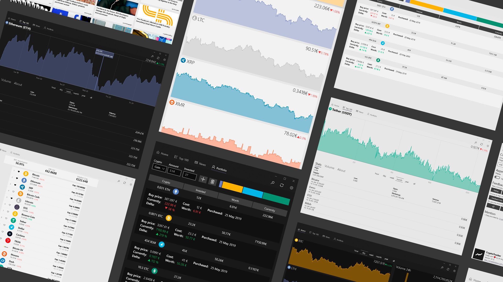
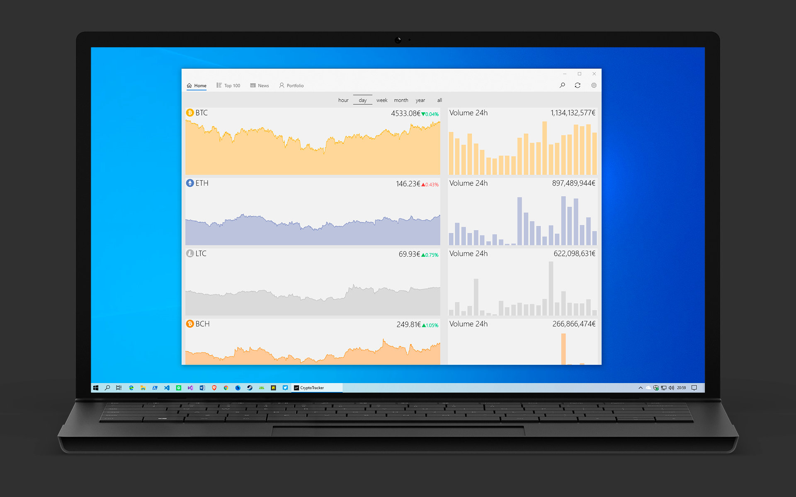
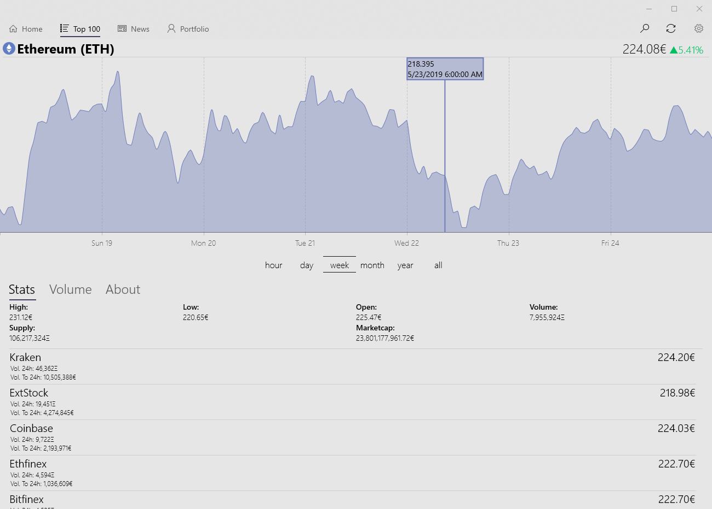
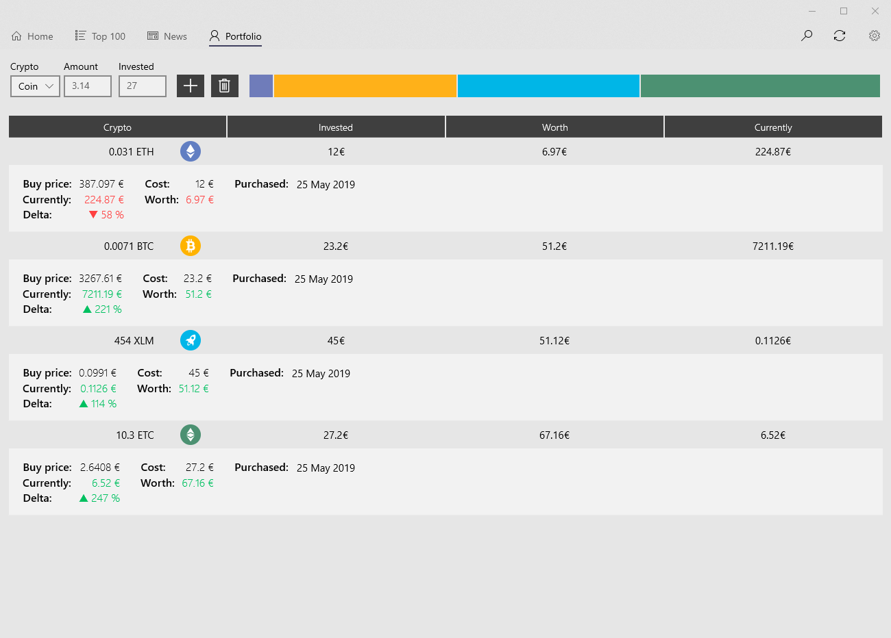
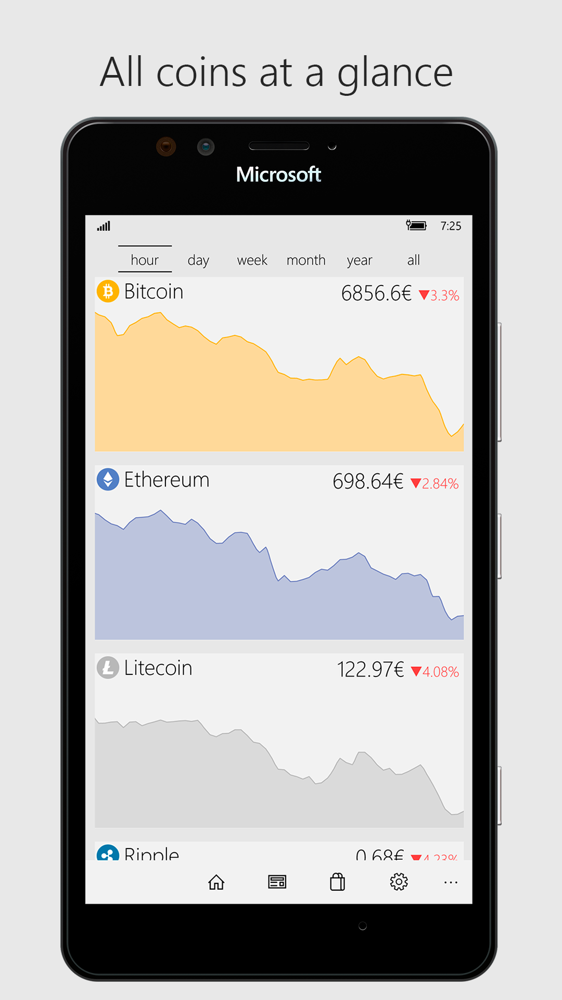
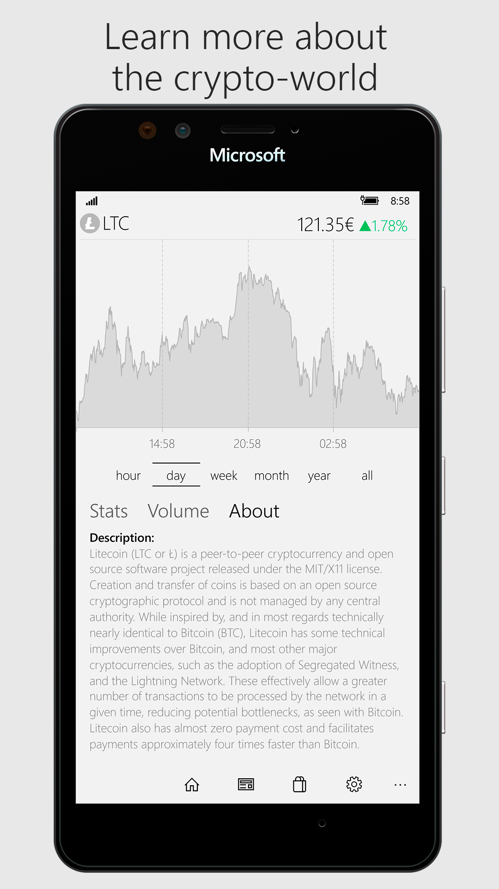

- Keep track of your favourite coins by pining them to the dashboard
- Adjustable **hourly/daily/weekly/monthly charts**
- Supports **over 100 cryptocurrencies**!
- Portfolio to keep track of all your purchases (with **cloud backup**).
- Keep up with the latest news.
- Currencies: EUR, USD, GBP, AUD, MXN, CNY, JPY, INR...
- Beautiful light and dark fluent themes!

## Detailed overview of each coin:

	

## Your portfolio at a glance:

	

## Mobile version (discontinued):

	  

# Milestones:
#### 5.0:
- Edit and sort your portfolio!
- Improved appearance of graphs
- Filter the news with tags
- Under the hood improvements and fixes

#### 4.5:
- New animations between pages!
- Pin/Unpin coins directly from a coin's page.
- Portfolio page improved (plus cloud backup)
- Bug fixes

#### 4.0:
- Added smooth animations!
- Improved navigation 
- Portfolio with detailed info.

#### 3.0:
- New Fluent Design!
- Add coins to Home with the heart button!
- See the volume of each coin from Home.
- Portfolio now supports 100 altcoins.
- Added Top100 coins and News page
- Added minimal colorized icons to more coins.
- Bug Fixes

#### 2.0:
- New logo, name and fluent UI
- Added 100 altcoins! (try using the search icon)
- Last hour chart refresh automatically
- Richer settings page
- Be sure to check out the new subreddit
- Added GBP, AUD, JPY and INR
- Refined UI

#### 1.5:
- New minimal UI for both PC and mobile.
- New Portfolio section
- Added 24h stats and 24h volume chart.
- Added animations when loading a chart
- Changed sliders to buttons (for less bugs)
- CAD, CNY and MXN added to currency options.
- Few errors fixed.

#### 1.2:
- Ability to choose between EUR and USD
- More friendly mobile UI (still WIP)
- Added the bases for 

#### 1.1:
- Added local storage to save choosen theme. (Light/Dark theme)
- New navigation method (hamburger menu).
- Created new pages for future extra info of each coin (stats).

#### 1.0:
- First stable final version of the app sent to the Windows Store.
- One single page with graphics for Bitcoin, Ethereum and Litecoin.
- Each coin has a slider to choose a time-span for the graph.

---

# Suggest anything at:
 Mail: ismael.em@outlook.com

 Reddit: [r/CryptoTracker](https://www.reddit.com/r/CryptoTracker/)

 Twitter: [@ismaelestalayo](https://twitter.com/ismaelestalayo)
