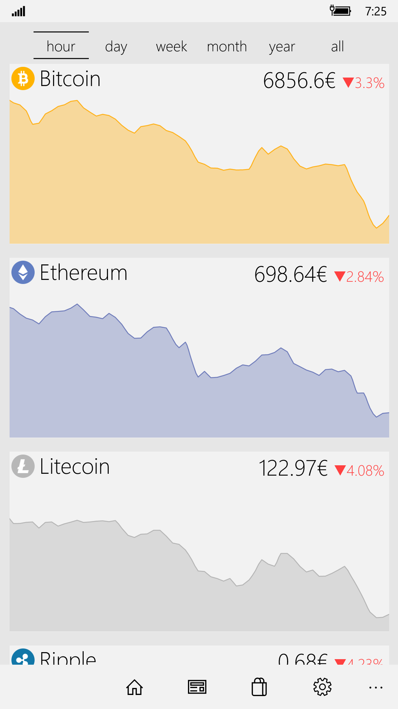
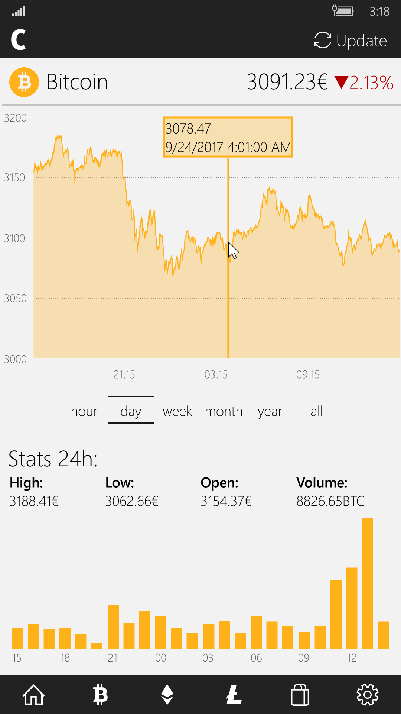
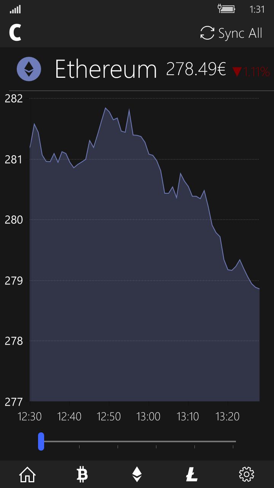

# CryptoTracker
A simple yet powerful crypto-currency tracker UWP.

- Adjustable charts to show last hour/day/week/month... 
- Supports Bitcoin, Ethereum, Litecoin and Ripple (with more to come)
- Currencies: EUR, USD, GBP, AUD, MXN, CNY, JPY, INR...
- Beautiful light and dark theme for you to choose!

## PC Version

## Mobile version:

 
 

# Milestones:
#### 3.0:
- Editable home layout
- Added top100 coins page
- Added news page
- Refined UI
- Added minimal logos for coins

#### 2.3:
- Added 100 altcoins! (try using the search icon)
- Richer settings page
- Be sure to check out the new subreddit
- Refined UI

#### 2.0:
- New logo, name and fluent UI
- Last hour chart refresh automatically
- WIP Live tile
- Added GBP, AUD, JPY and INR

#### 1.5:
- Improved the whole UI (tons of details)
- New Portfolio section
- Changed sliders to buttons (for less bugs)
- Added animations when loading a chart
- Added support for CNY ¥

#### 1.4:
- New minimal UI for both PC and mobile.
- CAD and MXN added to currency options.
- Added 24h stats and 24h volume chart.
- Few errors fixed.

#### 1.2:
- Ability to choose between EUR and USD
- More friendly mobile UI (still work in progress)
- Added the bases for 

#### 1.1:
- Added local storage to save choosen theme. (Light/Dark theme)
- New navigation method (hamburger menu).
- Created new pages for future extra info of each coin (stats).

#### 1.0:
- First stable final version of the app sent to the Windows Store.
- One single page with graphics for Bitcoin, Ethereum and Litecoin.
- Each coin has a slider to choose a time-span for the graph.

# Task list:
- [x] Adjust the time range of each graphic independently
- [x] Dark and light and dark theme
- [x] Support for EUR, USD, CAD, MXN
- [x] Mobile friendly UI
- [x] Stats about each coin on their pages
- [x] Portfolio to keep track of earnings
- [ ] Live tile
- [x] More cryptocurrencies
- [ ] More languages
- [ ] Log in to CoinBase/Kraken account
- [ ] Port to Android (dev account is 20€)
- [ ] Port to iOS (dev account is 100€/year + must have a Mac)

# Suggest anything at:

 Mail: ismael.em@outlook.com
 
 Reddit: [r/CryptoTracker](https://www.reddit.com/r/CryptoTracker/)

 Twitter: [@isma_estalayo](https://twitter.com/isma_estalayo)
